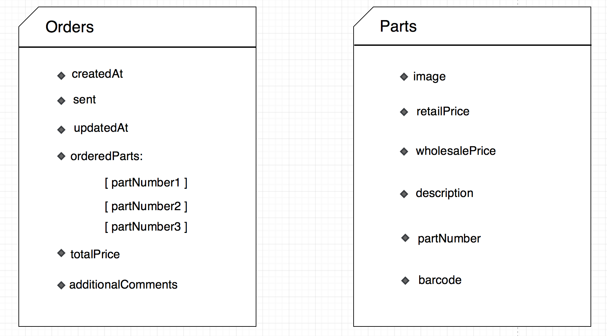
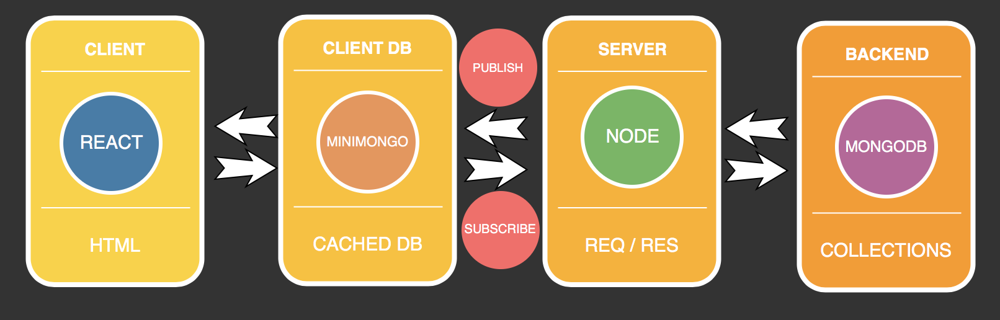
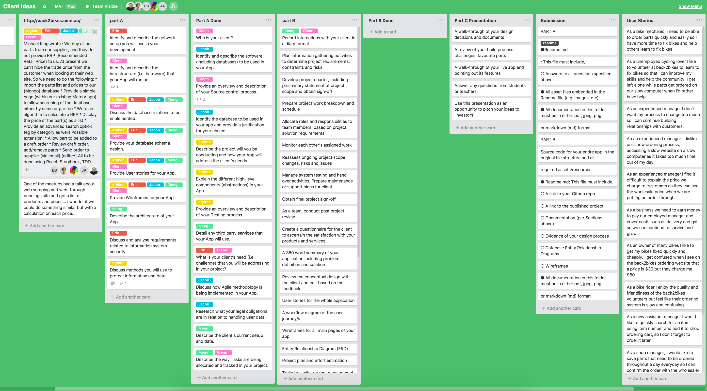
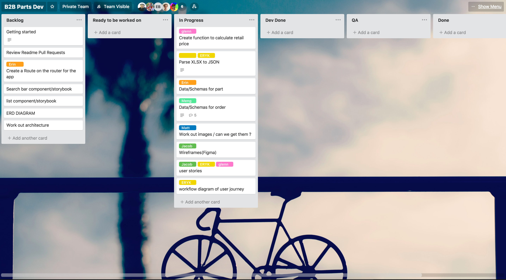
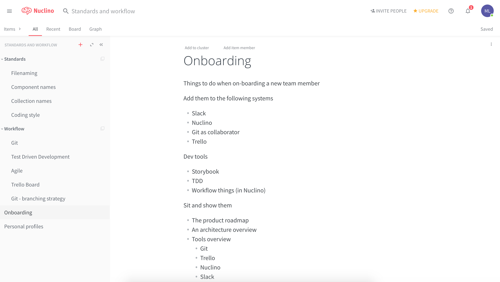

# # 3. Describe the client’s current setup and data.


### React JS 
Used in the front-end. This front-end framework will allow us to segregate all of our on-screen components letting us combine them into a well-designed UI for the user. Manipulation of component props and state will be updated in real-time so load times are much less.

### MongoDB
 Used as the Database. Mike from Back2bikes has already set up his existing web-app with mongo and for consistency we will do the same. MongoDB is a table-less database and stores data in JSON-like documents.

### Meteor
A full-stack javascript platform. It includes different libraries for building connected-client reactive applications. It allows us to develop in javascript across all environments, i.e. application server and web-browser.

### Semantic UI 
A modern front-end development framework that provides a sleek, subtle, and flat design look that provides a lightweight user experience. It uses minimal and neutral styling which allows ample room for customization.

### Story Book
A development environment for UI components. It Helps visualize the states of UI components and develop them interactively. Storybook runs independantly, it is does not have specific dependancies and requirements.

### Docker
A containerize platform that is designed to make it easier to create,deploy and run applications. By packaging up the parts needed such as libraries and other dependancies which is then deploys everything as one container.

# 8. Describe the architecture of your App.

The architecture of our app consist of a front-end and a backend. 

### Back-end
In the backend we are using MongoDB Database. Although MongoDB is schema-less database and is document orientated, it is good practice to constrain the contents of the collections to conform to a known format. 

That way we do not need to write defensive code to check and confirm the structure of the data as it _comes out_ of the database, instead of when it _goes into_ the database. The logic behind creating a schema in a document-orientated database is because we tend to _read data_ more often you _write it_.


*Parts schema and Order schema*



### Front-end
We are using React on the front end to render components on the client side.  
We use _Minimongo_ library which creates a local cache in the front-end allowing that allows us make live-updating database queries.

### App Architecture

Meteor initializes code from the _Client and Server_ directory. Both _Client and Server_ will point to the configuration files in the _startup_ directory and load all the code.

*The app's main architecture is made up client, server and imports .*
```
server/
client/
imports/
    startup/ 
        server/ 
        client/
    api/ 
    ui/
```

*App Flow*




### Deployment 

The app will be deployed on Heroku. All builds and releases will be managed on Heroku.


# 10. Detail any third party services that your App will use.

There are no direct or obvious third party services used. However we are using: 
* React by Facebook
* Heroku ( Deployment )

# 16. Describe the way Tasks are being allocated and tracked in your project.
### Agile
Agile methodology is used in many software development environment, we have stand ups every morning and record them into our trello board. 

#### Trello 
We used Trello, a project management tool to allocate and track key milestones in our project and Nuclino, a workflow management tool.

### Internal Team Trello Board
- Tasks filled on cards are required for planning phase.
- List down all tasks that needs to be completed.
- Use trello color labels to allocate task to each team member.
- Dedicated columns (swim lanes) for completed tasks.
- Summaries of Agile standups.



### Back2Bikes (Client) Trello Board
- Collaborative board with client.
- Consist of tasks of the development phase. 
- Tasks include features that are inspired from user stories and user pains.
- Columns (swin lanes): Backlog, Ready, In-progress, Dev Done, QA, Done



## Nuclino
Each member should reflect, track and manage the workflow to ensure that we are maintaining consistency with the standards provided by the client. Using all the dev tools will be important for collaboration and achieving efficiency.

Stndards
* Filenaming
* Component names
* Collection names
* Coding style

Workflow
* Git
* Test Driven Development
* Agile
* Trello Board
* Git- Branching strategy



